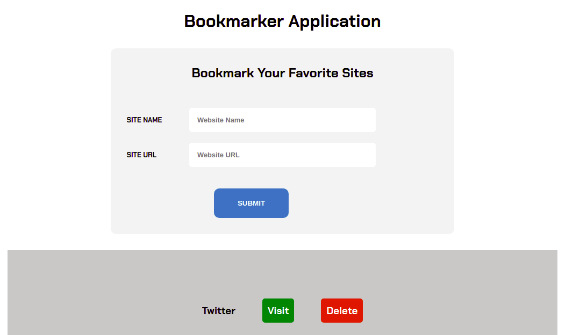

# Bookmark Application

## Technologies used: 
   1. HTML
   2. CSS
   3. JAVASCRIPT

### This is a Bookmarking application built using HTML/ CSS/ JavaScript.

**Link to the APP** :  https://bookmarker-application.vercel.app

* This application helps you in saving your favorite website URLs and visiting them later.

* You can search for the breed by clicking the links in the navigation.

## To run the project locally just clone it using this command: 

*git clone https://github.com/Trend20/bookmarker-application.git*

* Then open the index.html file in your favorite browser. 